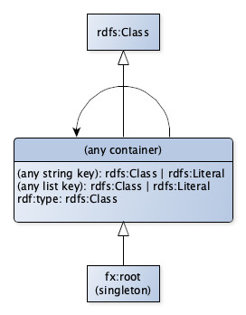

# Facade-X

Facade-X is a simplistic meta-model used by SPARQL Anything transformers to generate RDF data from diverse data sources.
Intuitively, Facade-X uses a subset of RDF as a general approach to represent the source content *as-it-is* but in RDF.
The model combines two types of elements: [containers](https://www.w3.org/TR/rdf11-schema/#ch_containervocab) and [literals](https://www.w3.org/TR/rdf11-schema/#ch_literal).
While literals are used to represent primitive data types (i.e. strings, integers etc.), containers represent an information unit of a data source.
This could be an array or an object in JSON format, a Row in CSV, or an element in XML.
Therefore, the interpretation of what is a container is on a format base.
Please refer to the [supported format description](README.md#supported-formats) to more details on what is a container.
Facade-X always has a single root container.
Container members are a combination of key-value pairs, where keys are either RDF properties or container membership
properties.
Instead, values can be either RDF literals or other containers.
Containers may have a type.

The following figure illustrates the resulting Facade-X as an entity-relation diagram.

Given a resource, the transformers generate an RDF Dataset (i.e. a collection of named graphs) representing the transformation of the resource according to the Facade-X model.
In particular, each named graph: 1. is the transformation of a data source of the input resource; and, 2. complies with the Facade-X model.
The default graph of the resulting RDF Dataset is the union of all the named graphs.

## IRI conventions

As general meta-model for representing diverse data sources in RDF, Facade-X does not prescribe any IRI convention.
However, SPARQL Anything implements convenient conventions for homogenising IRIs generated. 

### Default configuration

By default, SPARQL Anything uses blank nodes to represent containers.

The URI of the RDF properties is the result of the concatenation of the default namespace for data ``http://sparql.xyz/facade-x/data/`` and a string.
The string derives from a field name (in case of a data source in JSON format), a tag attribute (in case of a data source in JSON format) etc.

The URI of the RDF classes is the result of the concatenation of the default namespace for data ``http://sparql.xyz/facade-x/data/`` and a string.
The string derives from a tag name (in case of a data source in XML format), an element type (in case of a data source in Markdown format).

The URI of the named graph is always equal to the `uri-root-container`.

The URI of the root container (indicated as `uri-root-container`) is as follows: `base` + `/` + `identifier-of-the-data-source`.
Where `base` can be:
- the value of the option `root`
- the URI of the location  (in the case of location argument  set) 
- **or**,  'http://sparql.xyz/facade-x/data/' + md5Hex(content) (in the case of content argument set)
- **or** 'http://sparql.xyz/facade-x/data/' + md5Hex(command) (in the case of command argument set)
Note that, in case that the resource has a single data source the `uri-root-container` resolves to the value of the `root` option.

The URI of the default named graph is ``urn:x-arq:DefaultGraph``.

### Blank nodes = false

When the option `blank-nodes` is set as `false`, containers are represented as URI resources.
In this case, the URI of the container is `uri-root-container` + `\` + `path-to-the-container-in-the-data-source`.
The notion of path is format-specific (for example, is the JSONPath leading to the object for the JSON format or the row number for the CSV format).

## Terminology
- *Resource*: We consider a resource anything accessible from a URL (e.g. a spreadsheet file) and distinguish it from its content, that we name data source (e.g. a sheet of a spreadsheet).
- *Data source*: The content of a data source.
- *Location*: The URL of a data source.

